# CS691-XIX AI for Social Good
# Assignment - 2

# Medical Specialty Classification: Zero-Shot, Few-Shot, and Fine-Tuning Workflows
## See Nice Rendered Notebooks at the [Quarto Page](https://guntas-13.github.io/CS691_AISG/)!

This assignment asked us to classify medical case descriptions into specialties using transformer models with three approaches: **zero-shot prompting**, **few-shot prompting**, and **fine-tuning**. We use the [`hpe-ai/medical-cases-classification-tutorial`](https://huggingface.co/datasets/hpe-ai/medical-cases-classification-tutorial) dataset, which contains medical descriptions and corresponding specialties (e.g., "Cardiovascular / Pulmonary", "Orthopedic"). The goal is to predict the correct specialty from a set of 13 unique classes.

We explore:
1. **Zero-Shot Prompting**: Leveraging a pre-trained language model without task-specific training.
2. **Few-Shot Prompting**: Providing a few examples to guide the model’s predictions.
3. **Fine-Tuning**: Training three models ([`Llama-3.2-3B-Instruct`](https://huggingface.co/meta-llama/Llama-3.2-3B-Instruct), [`Gemma-3-1b-it`](https://huggingface.co/google/gemma-3-1b-it), [`DeepSeek-R1-Distill-Qwen-1.5B`](https://huggingface.co/deepseek-ai/DeepSeek-R1-Distill-Qwen-1.5B)) on the dataset for optimal performance.

---

## Weights and Biases

The fine-tuned model weights, prediction, training logs, and metric were all logged on Weights and Biases. See the [report](https://api.wandb.ai/links/guntas-13-indian-institute-of-technology-gandhinagar/jee0kzjy).

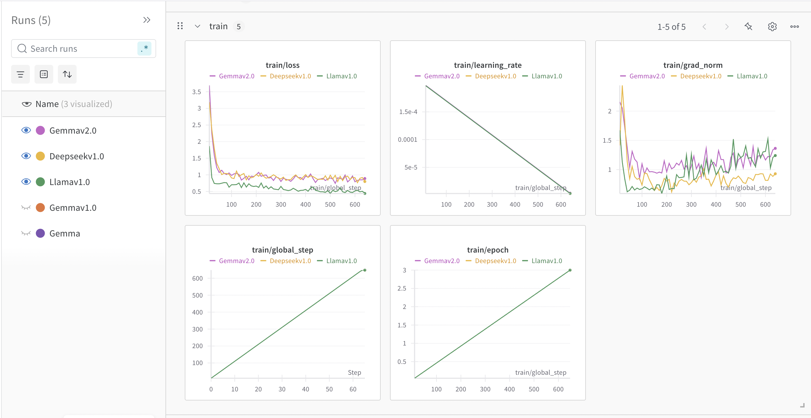

## Directory structure

The directories named `llm_<model-name>` contain the `ipynb` for the Zero-Shot and Few-Shot prompting, meanwhile those named `train_<model-name>` contain the Fine-Tuning Code. Also, see the fine-tuned model predictions in the [`predictions`](./predictions/) folder.

```
Directory structure:
└── guntas-13-cs691_aisg/
    ├── images/
    ├── posts/
    │   ├── llm_deepseek/
    │   │   └── llmprompting-deepseek.ipynb
    │   ├── llm_gemma/
    │   │   └── LLMPrompting.ipynb
    │   ├── llm_llama/
    │   │   └── LLM_Llama.ipynb
    │   ├── train_deepseek/
    │   │   └── HealthcareFineTuning_Deepseek.ipynb
    │   ├── train_gemma/
    │   │   └── HealthcareFineTuning_Gemma.ipynb
    │   ├── train_llama/
    │   │   └── HealthcareFineTuning_Llama.ipynb
    └── predictions/
        ├── predictions_deepseek.csv
        ├── predictions_gemma.csv
        └── predictions_llama.csv
```

## Setup and Data Preparation

### Dataset
The dataset is sourced from Hugging Face [`hpe-ai/medical-cases-classification-tutorial`](https://huggingface.co/datasets/hpe-ai/medical-cases-classification-tutorial) and split into train (1724 samples), validation (370 samples), and test (370 samples) sets. Each sample includes a `description` and a `medical_specialty`.

### Environment Setup
We use Python with key libraries for NLP, machine learning, and visualization.

```python
!pip install -U transformers datasets rapidfuzz torch sklearn pandas matplotlib seaborn

import torch
from transformers import pipeline, AutoTokenizer, AutoModelForCausalLM, AutoModelForSequenceClassification, Trainer, TrainingArguments
from datasets import load_dataset
import pandas as pd
import re
from rapidfuzz import fuzz, process
import numpy as np
from sklearn.metrics import precision_recall_fscore_support, confusion_matrix
import matplotlib.pyplot as plt
import seaborn as sns

# Set CUDA environment variable for debugging
import os
os.environ["CUDA_LAUNCH_BLOCKING"] = "1"

# Load dataset
ds = load_dataset("hpe-ai/medical-cases-classification-tutorial")

# Get unique classes
df = pd.DataFrame(ds["train"])
classes = list(set(df["medical_specialty"]))
cls_str = ", ".join(classes)
print(f"Number of classes: {len(classes)}")
```

**Rationale**: 
- **Libraries**: `transformers` and `datasets` handle model loading and data processing; `rapidfuzz` aids in fuzzy matching for prediction post-processing; `torch` enables GPU acceleration.
- **Dataset**: We extract unique classes to define the classification space and prepare a string for prompts.

---

## 1. Zero-Shot Prompting

### Overview
Zero-shot prompting uses a pre-trained language model (e.g., `meta-llama/Llama-3.2-3B-Instruct`) to classify without training, relying on its understanding of language and instructions.

### Code

```python
# Login to Hugging Face
!huggingface-cli login --token YOUR_HF_TOKEN

# Load model and tokenizer
model_name = "meta-llama/Llama-3.2-3B-Instruct"
device = 0 if torch.cuda.is_available() else -1
tokenizer = AutoTokenizer.from_pretrained(model_name)
tokenizer.padding_side = "left"  # For decoder-only models
model = AutoModelForCausalLM.from_pretrained(model_name, torch_dtype=torch.float16).to(device)

if tokenizer.pad_token is None:
    tokenizer.pad_token = tokenizer.eos_token
    tokenizer.pad_token_id = tokenizer.eos_token_id
    model.config.pad_token_id = tokenizer.eos_token_id

classifier = pipeline("text-generation", model=model, tokenizer=tokenizer, device=device, torch_dtype=torch.float16, batch_size=4)

# Zero-shot prompt template
prompt_template = """
You are a medical expert tasked with classifying a disease description into one of these medical specialties: {cls_str}. Analyze the description carefully, focusing on symptoms, conditions, and medical terms. Select the most appropriate specialty from the list and output ONLY the specialty name inside brackets, like [Specialty Name]. Do not repeat the prompt or add extra text—just the prediction in this format: [Specialty Name].

Description: {description}

Predicted Medical Specialty: 
"""

# Format prompts
def format_prompts(example):
    example["prompt"] = prompt_template.format(cls_str=cls_str, description=example["description"])
    example["true_label"] = example["medical_specialty"]
    return example

dataset = ds["test"].map(format_prompts)

# Prediction function with post-processing
def predict_batch(examples):
    prompts = examples["prompt"]
    batch_preds = []
    try:
        results = classifier(prompts, max_new_tokens=10, do_sample=False, padding=True, truncation=True, pad_token_id=tokenizer.eos_token_id)
        for prompt, output in zip(prompts, results):
            generated_text = output["generated_text"][len(prompt):].strip()
            pattern = '|'.join(map(re.escape, classes))
            match = re.search(pattern, generated_text)
            if match:
                pred = match.group(0)
            else:
                if "Cardiology" in generated_text:
                    pred = "Cardiovascular / Pulmonary"
                else:
                    best_match = process.extractOne(generated_text, classes, scorer=fuzz.partial_ratio)
                    pred = best_match[0]
            batch_preds.append(pred)
        examples["prediction"] = batch_preds
    except RuntimeError as e:
        print(f"Error: {e}")
        examples["prediction"] = ["Error"] * len(prompts)
    finally:
        torch.cuda.empty_cache()
    return examples

dataset = dataset.map(predict_batch, batched=True, batch_size=4)

# Compute metrics
df_results = dataset.to_pandas()
true_labels = df_results["true_label"].tolist()
pred_labels = df_results["prediction"].tolist()

precision, recall, f1, _ = precision_recall_fscore_support(true_labels, pred_labels, average="weighted", zero_division=0)
conf_matrix = confusion_matrix(true_labels, pred_labels, labels=classes)
```

### Explanation and Rationale
- **Prompt Design**: The template provides clear instructions and a list of specialties, expecting output in a specific format (`[Specialty Name]`).
- **Post-Processing**: Regex matches exact class names; fuzzy matching handles cases where the model outputs similar terms (e.g., "Cardiology" → "Cardiovascular / Pulmonary").

### Results

# Gemma-3-1b-it
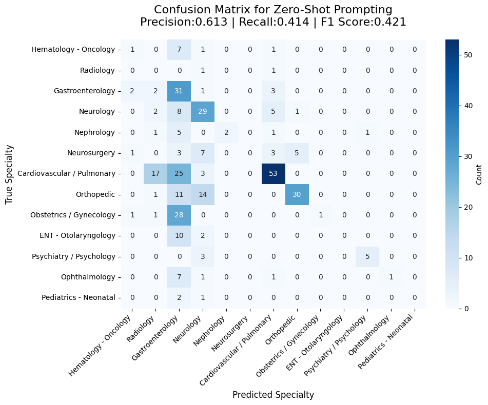

# Llama-3.2-3B-Instruct
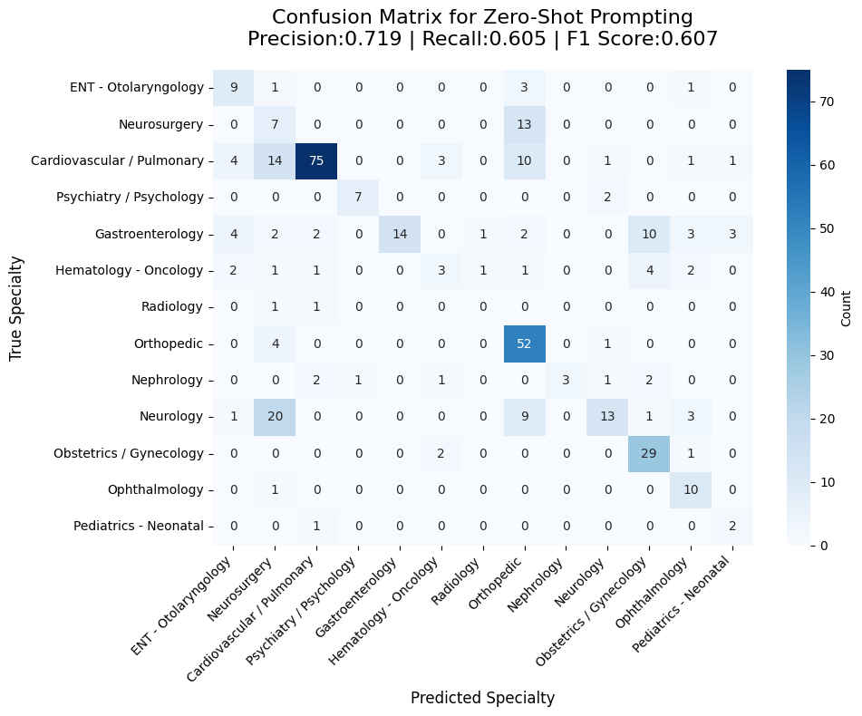

# DeepSeek-R1-Distill-Qwen-1.5B
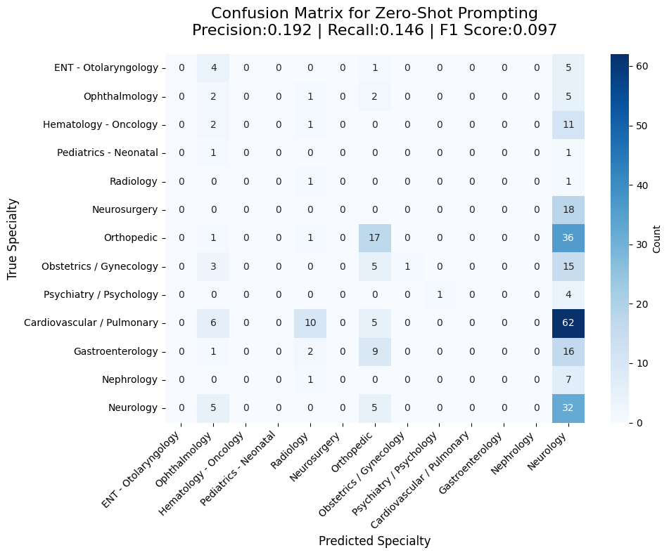

---

## 2. Few-Shot Prompting

### Overview
Few-shot prompting enhances zero-shot by providing a small number of labeled examples in the prompt, guiding the model’s predictions.

### Code

```python
# Few-shot prompt template
few_shot_template = """
You are a medical expert classifying disease descriptions into medical specialties. Below are {num_shots} examples to guide you. Each example includes a description and its medical specialty. Based on these examples, classify the new description into one of these specialties: {cls_str}. Output ONLY the specialty name inside brackets, like [Specialty Name].

Examples:
{examples}

New Description: {description}

Predicted Medical Specialty:
"""

# Generate examples
def create_random_examples(dataset, num_shots):
    df = pd.DataFrame(dataset)
    unique_labels = df["medical_specialty"].unique()
    selected_indices = []
    for label in unique_labels[:num_shots]:
        label_indices = df[df["medical_specialty"] == label].index.tolist()
        selected_indices.append(np.random.choice(label_indices))
    examples = ""
    for i, idx in enumerate(selected_indices, 1):
        row = dataset[int(idx)]
        examples += f"{i}. Description:\n{row['description']}\nMedical Specialty:\n{row['medical_specialty']}\n\n"
    return examples

num_shots = 10
examples_str = create_random_examples(ds["train"], num_shots)

# Format few-shot prompts
def format_few_shot_prompts(example):
    example["prompt"] = few_shot_template.format(num_shots=num_shots, cls_str=cls_str, examples=examples_str, description=example["description"])
    example["true_label"] = example["medical_specialty"]
    return example

dataset = ds["test"].map(format_few_shot_prompts)

# Use the same predict_batch function as zero-shot
dataset = dataset.map(predict_batch, batched=True, batch_size=4)

# Compute metrics
df_results = dataset.to_pandas()
true_labels = df_results["true_label"].tolist()
pred_labels = df_results["prediction"].tolist()

precision, recall, f1, _ = precision_recall_fscore_support(true_labels, pred_labels, average="weighted", zero_division=0)
conf_matrix = confusion_matrix(true_labels, pred_labels, labels=classes)
```

### Explanation and Rationale
- **Prompt Design**: Adds examples to the zero-shot template, leveraging in-context learning to improve accuracy.
- **Example Selection**: Randomly selects one example per unique class (up to `num_shots`), ensuring diversity and coverage.

### Results

# Gemma-3-1b-it
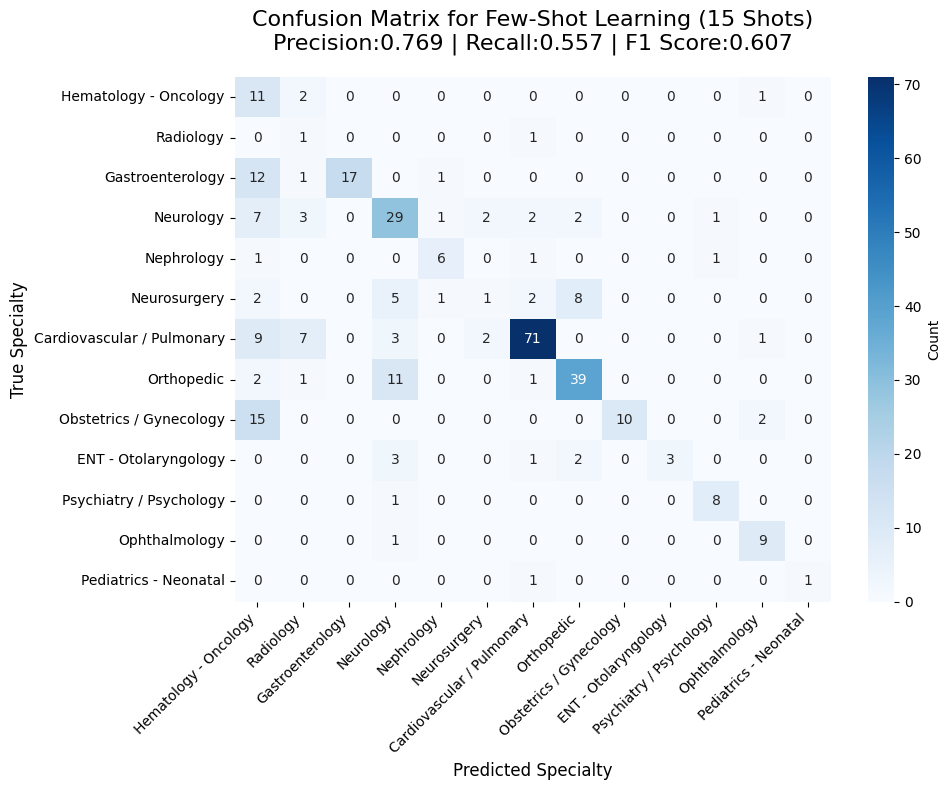

# Llama-3.2-3B-Instruct
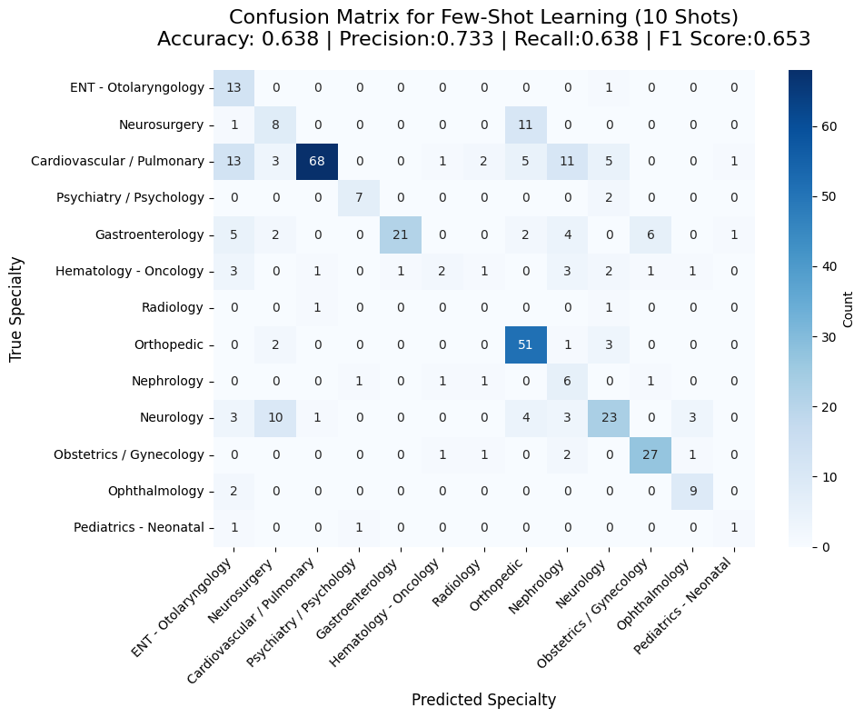

# DeepSeek-R1-Distill-Qwen-1.5B
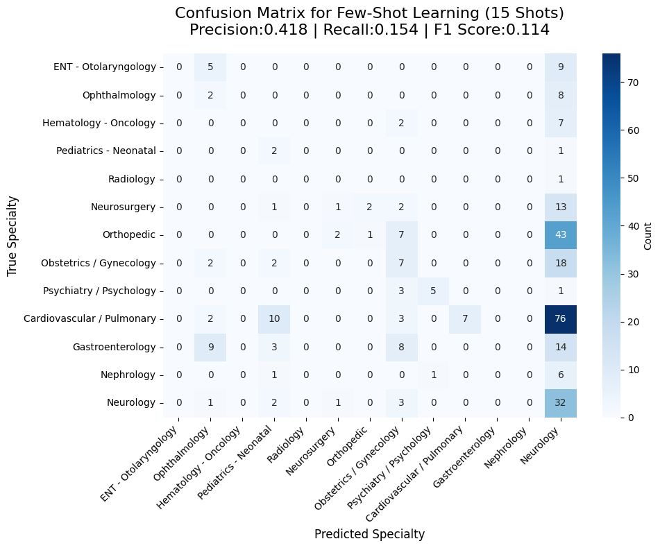

---

## 3. Fine-Tuning

### Rationale
- **Training**: 3 epochs with a small batch size (4) and FP16 optimize GPU usage; validation ensures the best model is saved.
- **Metrics**: Precision, recall, and F1 are computed to evaluate performance.

### Results

# Gemma-3-1b-it
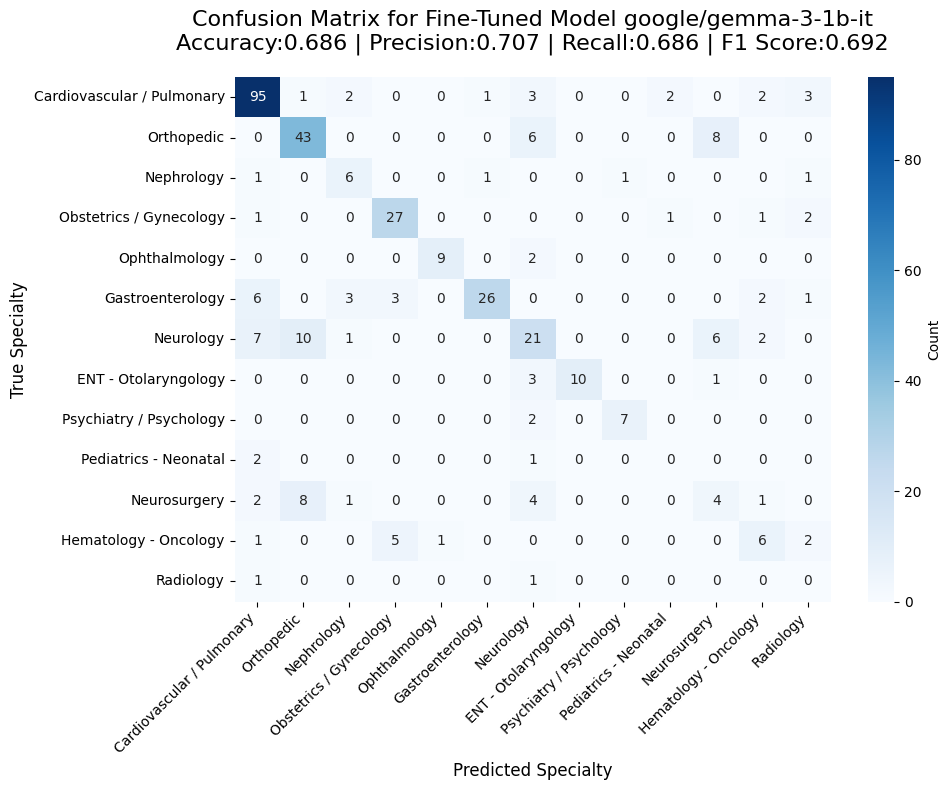

# Llama-3.2-3B-Instruct
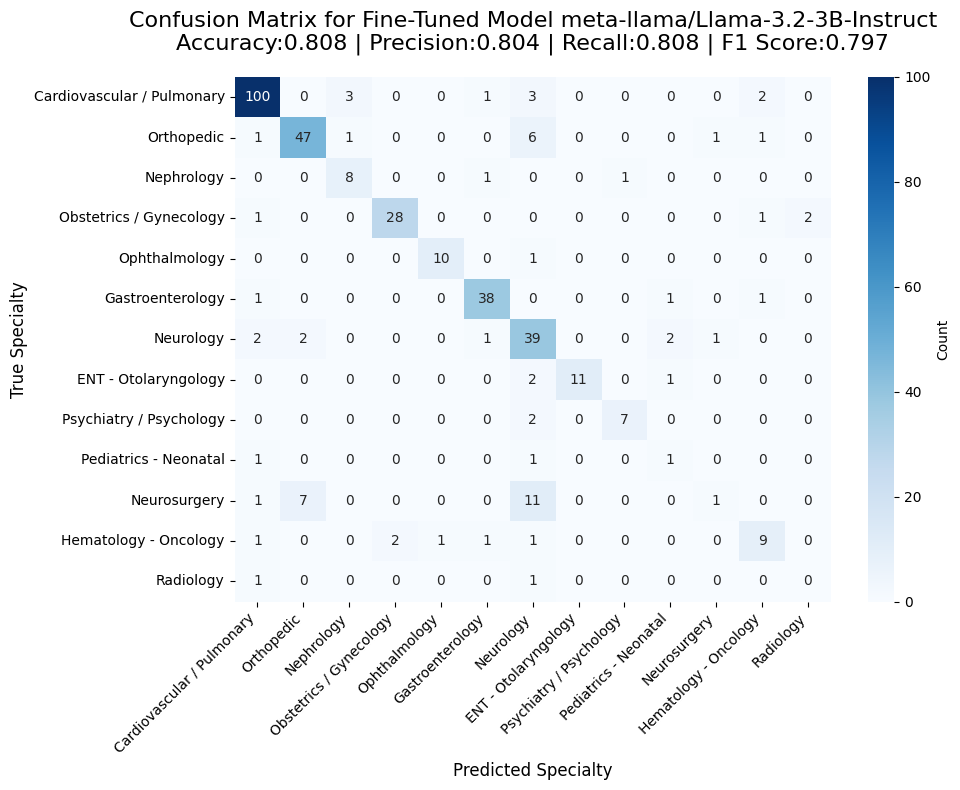

# DeepSeek-R1-Distill-Qwen-1.5B
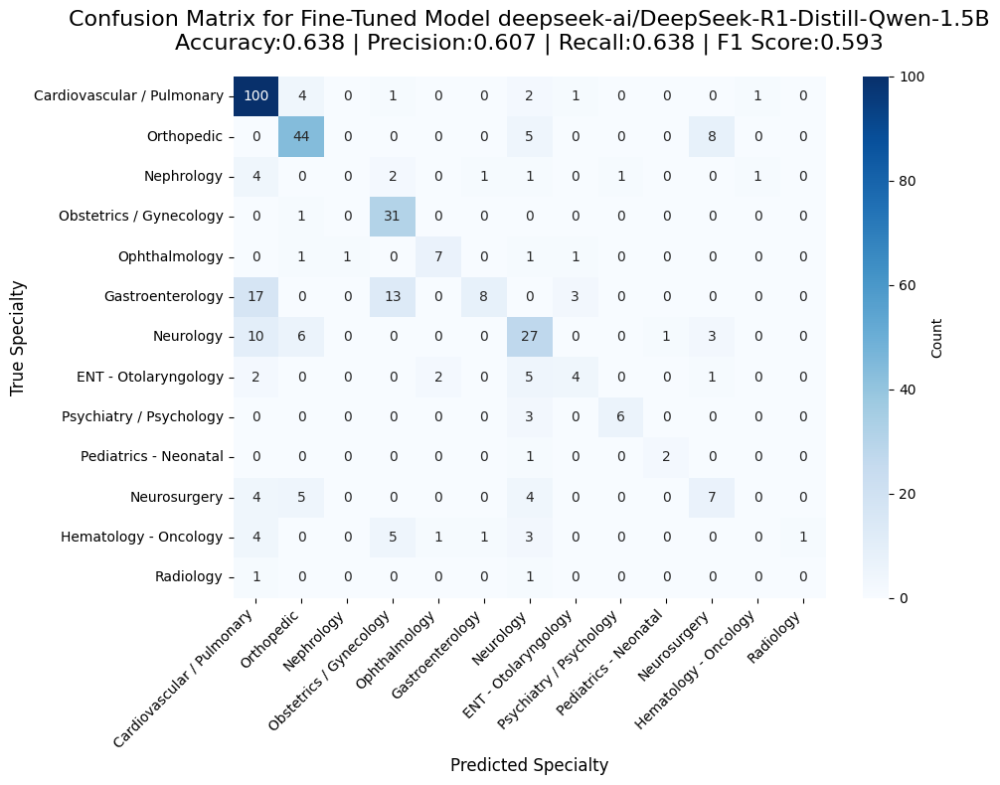

---

## Conclusion
- **Zero-Shot**: Quick and no training required, but relies heavily on model’s pre-trained knowledge and prompt clarity.
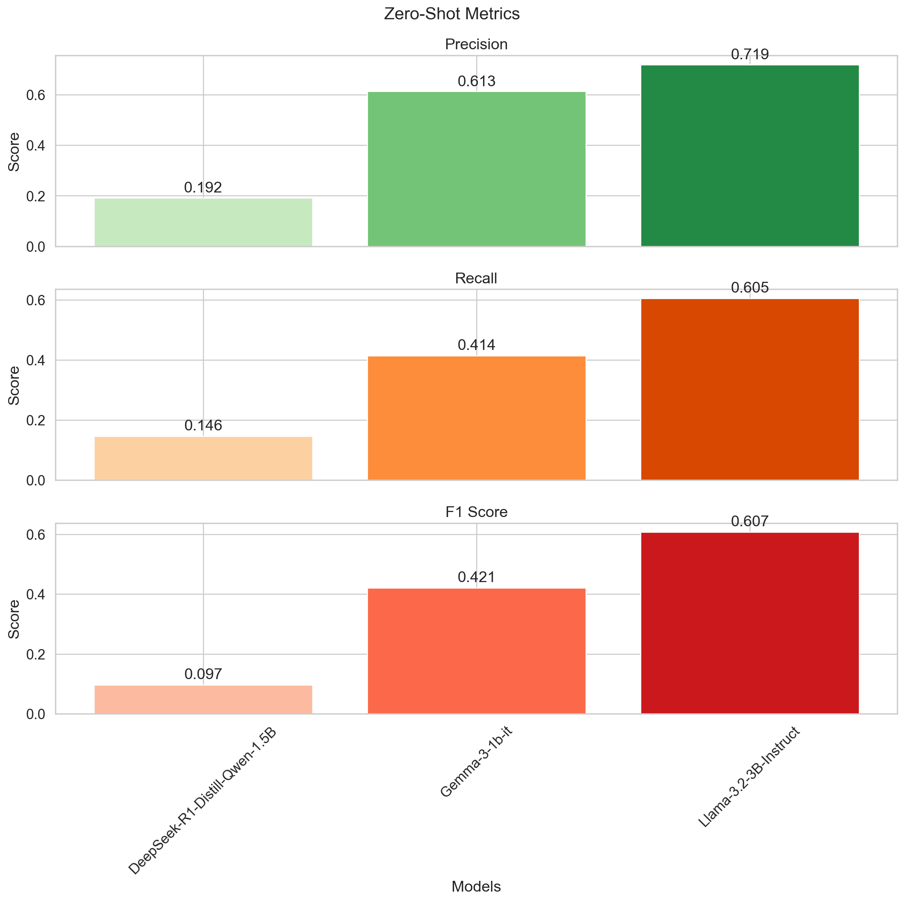

- **Few-Shot**: Improves over zero-shot by providing context, still no training, but limited by context window.
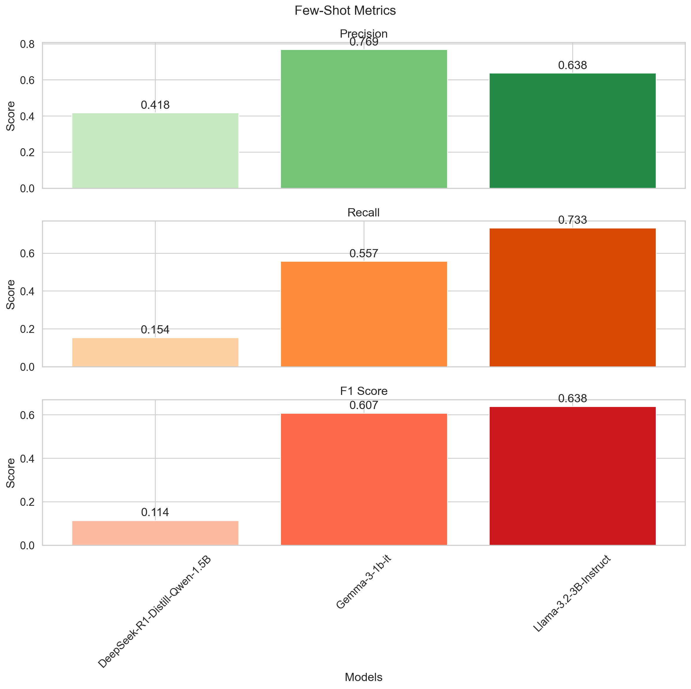

- **Fine-Tuning**: Offers the best performance by adapting models to the task, though it requires computational resources and labeled data.
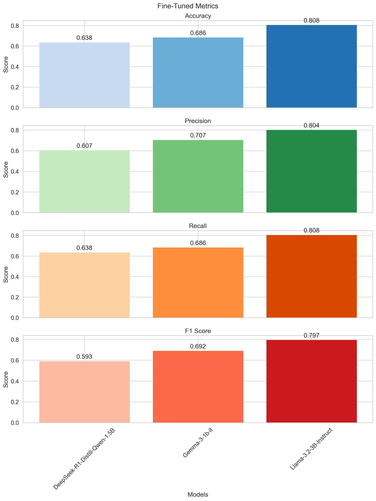

--- 

# Assignment - 1

### Repo Structure<br>
### This repo has the source code which has been deployed on Github Pages via `quarto`. One can view the source codes in the directory `posts` as follows:
- `posts/split`: Code for *Prequel: Dataset Split & Exploration (initial exploration)*
- `posts/data_analysis`: Code and Media for *Part 1: Dataset Exploration and Understanding*
- `posts/ios`: Code for *Part 2: Implementing Average Precision AP50*
- `posts/map`: Code for *Bonus: Leafmap Geotif generation*
- `posts/final`: Code for *Part 3: Model Training and Bonus (model predictions on out-of-sample data)*
- `posts/zeel`: Code for *Tutorial: YOLO Object Detection (added as reference)*<br><br>
or refer to the same on the Github Pages hosted at [AISG Assignment 1](https://guntas-13.github.io/CS691_AISG/)
